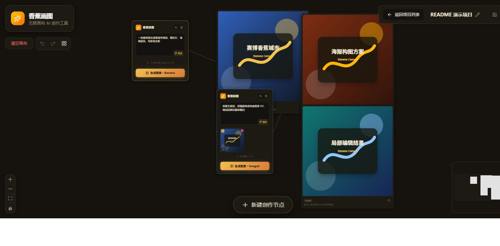
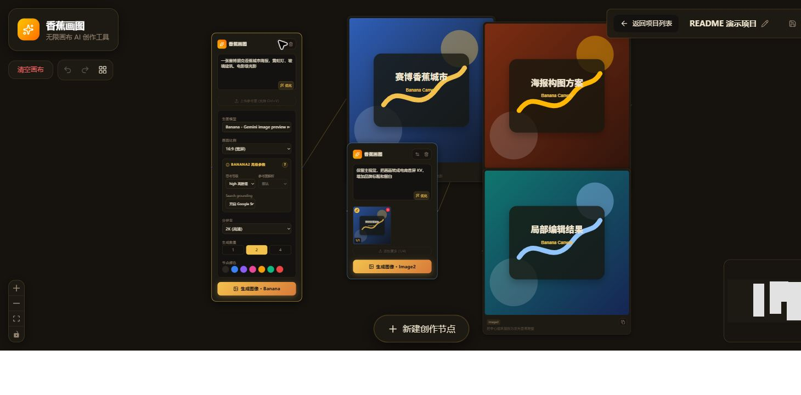
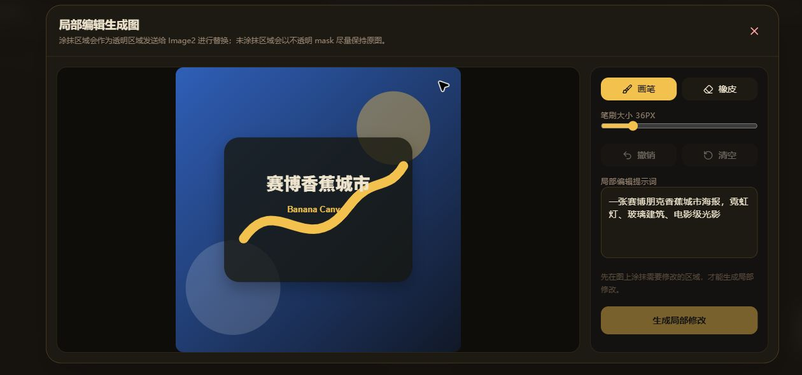

<div align="center">
  
</div>

# 香蕉画图

当前版本：`0.2.1`

一个类似 Flowith 的无限画布 AI 图像生成工具。你可以在画布上搭建提示词节点和图片节点，把一轮生成的结果继续作为下一轮参考图，逐步迭代出更复杂的视觉方案。

## 项目预览






## 适合场景

- 多轮视觉探索：把满意的生成结果继续作为参考图，逐步收敛风格、构图和细节。
- 海报、KV、角色设定、概念图等方案推演：用画布保留不同分支和中间结果。
- 局部编辑工作流：在已有图片上涂出需要修改的区域，再用 Image2 生成局部变化。
- 本地项目管理：按项目保存画布、节点关系和图片资产，便于回看和继续创作。

## 核心功能

- 无限画布工作流：基于 React Flow 搭建，可在画布上自由摆放、连线、缩放和整理节点。
- 创作节点：输入提示词后可直接生成图片，也可以先用 Gemini 3.1 Pro 优化提示词。
- 参考图输入：支持上传图片和 `Ctrl+V` 粘贴图片，单节点最多挂载 4 张参考图。
- 多参数生图：支持调整画幅比例、输出尺寸、单次生成数量、节点颜色，以及模型专属高级参数。
- 多模型生图：新创作节点默认使用 `Image2`，也可以切换到 `Banana`；生成出的图片节点会记录当次使用的模型。
- 批量生成：单个提示词节点一次可生成 `1`、`2` 或 `4` 张图片，并自动连到新图片节点。
- 图片节点操作：支持全屏查看、复制图片、复制提示词、下载、重新生成，以及“以此为参考新建节点”。
- 画布辅助：支持撤销/重做、适应视口、右键菜单、新建节点、自动布局、清空画布。
- 本地项目持久化：项目索引、画布快照和图片资产默认保存到仓库本地 `data/projects/`；无本地 API 时会回退到 IndexedDB。
- 应用内连接设置：项目列表和画布顶部都可以打开“模型设置”，直接配置 Image2 URL、API Key、模型、接口类型、代理和超时参数。
- 安全自动加载：桌面版使用 Electron `safeStorage` 加密保存 API Key，其他连接参数保存在当前用户的应用数据目录；界面只读取密钥是否已配置，不会把已保存的 Key 回传到浏览器。npm 模式继续使用仓库 `.env`。

## 运行环境

- Node.js 20.18.1 或更高版本
- 可用的 Image2/OpenAI-compatible 中转服务；如需 Banana 或提示词优化，再配置 Gemini API Key

## 本地启动

1. 安装依赖

```bash
npm install
```

2. 配置模型连接

启动应用后点击“模型设置”即可直接填写 Image2 Base URL、API Key 和模型名。保存后立即生效，后续启动会自动加载。

开发环境也可以复制一份 `.env.example` 为 `.env`，使用环境变量作为配置来源：

```bash
IMAGE2_BASE_URL=你的_Image2_Base_URL
IMAGE2_API_KEY=你的_Image2_Key
IMAGE2_MODEL=你的_Image2_模型名
```

如需使用 Banana 模型或 Gemini 提示词优化，再配置：

```bash
GEMINI_API_KEY=你的_Gemini_API_Key
```

只浏览项目、整理画布和查看已有截图不需要 API Key。

`IMAGE2_BASE_URL` 填 API base URL，例如 `https://example.com/v1`。如果误填成 `https://example.com/v1/chat/completions`，服务端也会自动解析回 `https://example.com/v1`。

`gpt-image-*` 模型会自动走 `/v1/images/generations` 或 `/v1/images/edits`；其他模型默认走 `/v1/chat/completions`。如需强制指定，可设置 `IMAGE2_ENDPOINT_TYPE=images` 或 `IMAGE2_ENDPOINT_TYPE=chat`。

服务端启动后会监听 `.env`。应用内保存和手动编辑 `.env` 都会热更新；如果新配置校验失败，服务端会拒绝保存并继续使用上一份有效配置。`PORT`、`NODE_ENV`、`BANANA_DATA_DIR` 是启动期配置，变更后会提示需要重启。

如果你在需要代理的网络环境下访问 image2 中转，也可以额外设置：

```bash
HTTPS_PROXY=http://127.0.0.1:7890
```

或：

```bash
HTTP_PROXY=http://127.0.0.1:7890
```

3. 启动开发服务器

```bash
npm run dev
```

4. 打开浏览器访问：

```text
http://localhost:3000
```

`npm run dev` 会启动 `server.ts`，同时挂载 Express API 和 Vite 中间件，适合本地完整调试。

服务默认只监听 `127.0.0.1`。只有明确需要局域网访问时才设置 `HOST=0.0.0.0`；当前项目接口不包含面向公网部署所需的用户认证层。

如需从源码直接启动 Electron 桌面版：

```bash
npm run electron
```

该命令会先构建前端和 Electron 主进程，再以桌面窗口运行同一套 Express API。npm 模式使用仓库根目录的 `.env` 和 `data/`；Electron 模式使用当前 Windows 用户的应用数据目录，安装目录保持只读。

## 使用方式

1. 首次使用先在项目列表点击“模型设置”，填写 Image2 连接参数。
2. 点击底部“新建创作节点”，或在画布空白处右键创建新节点；新节点默认选择 Image2。
3. 输入提示词；需要时可上传参考图，或直接在文本框里 `Ctrl+V` 粘贴图片。
4. 可先点击“优化”让 Gemini 3.1 Pro 改写提示词，再点击“开始生成”。
5. 生成结果会作为新的图片节点出现在当前节点右侧，并自动建立连线。
6. 悬停图片节点可执行复制、下载、全屏、重新生成、继续作为参考图等操作。
7. 当画布变复杂后，可以使用自动布局和适应视口快速整理结构。

## 快捷键

- `Ctrl+Enter` / `Cmd+Enter`：在当前提示词框内直接生成
- `Ctrl+Z` / `Cmd+Z`：撤销
- `Ctrl+Shift+Z` / `Cmd+Shift+Z`：重做
- `Ctrl+Y`：重做
- `N`：新建创作节点
- `F`：适应当前画布到视口
- `Delete` / `Backspace`：删除已选中的节点

## 参数与行为说明

### 创作节点

- Banana2 支持的画面比例：`1:1`、`1:4`、`1:8`、`2:3`、`3:2`、`3:4`、`4:1`、`4:3`、`4:5`、`5:4`、`8:1`、`9:16`、`16:9`、`21:9`
- Banana2 支持的分辨率：`512`、`1K`、`2K`、`4K`；旧项目中的 `512px` 会自动按官方 `512` 发送
- 支持的批量数量：`1`、`2`、`4`
- 参考图上限：4 张
- 默认生成模型：`Image2`；`Banana` 使用 `gemini-3.1-flash-image-preview`，`Image2` 使用应用内设置或 `.env` 中配置的 OpenAI-compatible 中转
- 提示词优化模型：`gemini-3.1-pro-preview`

### 图片节点

- 可复制图片到剪贴板
- 可复制对应提示词
- 可下载为本地 PNG
- 可基于同一提示词重新生成
- 可直接把当前图片转成下一轮创作节点的参考图

### 本地状态

- 本地开发默认把项目索引、画布快照和图片资产保存到 `data/projects/`。
- 桌面版把项目和模型连接配置保存到系统用户数据目录，不会写入安装目录；模型设置在启动时自动加载。
- npm 模式允许显式进程环境变量覆盖仓库 `.env`；Electron 模式则以用户数据目录中的 `.env` 为准，不会被安装器或父进程中的同名变量意外覆盖。
- npm 模式遇到非法 `.env` 会拒绝启动且不会改写文件；Electron 会迁移旧版无效字段，并把旧明文 API Key 转移到系统加密存储。
- 可用 `BANANA_DATA_DIR` 改变本地项目存储目录；相对路径会从项目根目录解析。
- 前端仍使用 `zustand + zundo` 管理画布状态和最多 50 步历史记录。
- 如果 `/api/projects` 不可用，会回退到 IndexedDB，并可在本地 API 可用时迁移旧浏览器项目。
- 未被当前画布或历史引用的图片资产会自动清理，避免无限膨胀。
- 本地删除项目时会先移入数据目录下的 `.trash/`，便于误删后的人工恢复；项目列表索引会立即移除该项目。
- 本地文件存储会为图片资产记录 `byteLength` 和 `sha256`，重复保存未变化资产时会复用已有文件；如果同一资产 ID 的内容确实变化，会重新写入。
- `data/` 已被 `.gitignore` 忽略，避免误提交用户本地项目图片。

### 性能与资源注意事项

- 常规项目加载和空画布首屏开销较小；Canvas 代码按路由懒加载。
- 项目自动保存会 debounce，并且不会重复写入未变化的本地图片文件。
- 当前保存接口仍会发送完整画布快照；包含大量大图的项目在节点移动或文本修改时仍可能产生较大的 JSON 请求。后续如果要进一步优化，需要把图片资产上传和画布元数据保存拆成增量协议。
- Image2 局部编辑的画笔移动不会反复扫描整张 mask 画布；大图撤销历史会按约 32 MB 内存预算动态减少帧数，小图最多保留 10 帧。
- 代理和 Image2 runtime 配置支持 `.env` 热重载；旧连接池由运行时 agent 缓存管理，频繁切换代理配置时建议观察连接数和内存。

### Banana2 高级参数

选择 `Banana` 模型后，提示词节点的设置面板会显示 Gemini Nano Banana 2 官方高级参数：

- `responseModalities`：固定发送仅 `IMAGE`，因为本项目只消费图片 part。
- `thinkingConfig.thinkingLevel`：发送官方枚举 `MINIMAL`、`LOW`、`MEDIUM`、`HIGH`；复杂文字、构图和多约束任务可提高等级，但会增加延迟。
- `mediaResolution`：控制参考图解析强度，支持 `MEDIA_RESOLUTION_LOW`、`MEDIA_RESOLUTION_MEDIUM`、`MEDIA_RESOLUTION_HIGH`。
- `tools.googleSearch`：可开启 Google Search grounding，让模型使用实时网页/图片搜索信息；通常会增加延迟和成本。
- `safetySettings`：骚扰、仇恨、色情、危险四类默认固定发送 `OFF`，前端不提供调节。
- Banana2 没有 Image2 的 `output_format`、透明背景独立开关、压缩、`partial_images`、mask 参数；透明背景只能通过提示词尝试。
- 服务端会使用 Gemini 返回的 `inlineData.mimeType` 生成 data URL，不再强制按 PNG 处理。

### Image2 高级参数

选择 `Image2` 模型后，提示词节点的设置面板会显示中转兼容的高级参数：

- 前端只开放实际需要调的参数：`quality`、`output_format`、`output_compression`、`response_format`、`partial_images`。
- `background` 固定发送 `opaque`，`moderation` 固定发送 `low`，`stream` 固定跟随 `.env` 的 `IMAGE2_STREAM`。
- `output_compression` 只会在 `output_format` 为 `jpeg` 或 `webp` 时发送。
- `gpt-image-2` 不支持 `background=transparent`；前端不提供透明背景选择，旧节点或手写请求也会在发送前丢弃。
- `input_fidelity` 对 `gpt-image-2` 不可调，官方要求省略；模型会自动高保真处理输入图。
- `CLIProxyAPI` 当前会忽略 `n`、`style`、`user`；前端的“生成数量”会用多次请求实现多图。
- `response_format=url` 在 `CLIProxyAPI` 中返回的是 `data URL`，不是官方 60 分钟临时 URL。
- `file_id` 编辑图不支持；当前项目通过上传/粘贴参考图走 multipart `image`，mask 局部编辑会把原图和蒙版统一转为同尺寸 PNG。

## 环境变量

| 变量名 | 用途 |
| --- | --- |
| `GEMINI_API_KEY` | 本地或服务端调用 Gemini API 时使用的默认 Key |
| `IMAGE2_BASE_URL` | Image2 中转 API base URL，使用 Image2 时必须配置，例如 `https://example.com/v1` |
| `IMAGE2_CHAT_COMPLETIONS_URL` | 可选，chat completions 完整 URL；未设置 `IMAGE2_BASE_URL` 时作为 fallback |
| `IMAGE2_API_KEY` | Image2 中转接口 Key，使用 Image2 时必须配置 |
| `IMAGE2_MODEL` | 发送到 Image2 中转接口的模型名，使用 Image2 时必须配置 |
| `IMAGE2_ENDPOINT_TYPE` | 可选，`images` 或 `chat`；默认 `gpt-image-*` 走 images，其他模型走 chat |
| `IMAGE2_HTTPS_PROXY` | 可选，image2 专用代理；不填时复用 `HTTPS_PROXY` 或 `HTTP_PROXY` |
| `IMAGE2_PROXY_MODE` | 可选，`proxy`、`auto` 或 `direct`；默认 `direct`，避免 image2 relay 被本机代理路径拖慢或 504 |
| `IMAGE2_MAX_ATTEMPTS` | 可选，image2 最大尝试次数，默认 `1`；调大可能产生重复生图成本 |
| `IMAGE2_HEDGE_ENABLED` | 可选，`true` 时在 `IMAGE2_MAX_ATTEMPTS > 1` 下启用 proxy/direct 并发竞速；默认关闭，避免额外 token 消耗 |
| `IMAGE2_STREAM` | 可选，`true` 时 images 接口请求 SSE 流式结果；适合中转有约 60s 空闲网关超时的情况 |
| `IMAGE2_PARTIAL_IMAGES` | 可选，流式 images 请求的局部图数量，范围 `0`-`3`；大于 `0` 更容易保持连接活跃，但可能增加 image token 成本 |
| `IMAGE2_REQUEST_TIMEOUT_MS` | 可选，image2 单次请求超时，默认 `240000` |
| `IMAGE2_RETRY_DELAY_MS` | 可选，image2 两次尝试之间的等待时间，默认 `1000` |
| `IMAGE2_PROXY_CONNECT_TIMEOUT_MS` | 可选，image2 代理建连超时，默认 `60000` |
| `IMAGE2_DIRECT_CONNECT_TIMEOUT_MS` | 可选，image2 直连建连超时，默认 `60000` |
| `IMAGE2_DIRECT_ALLOW_H2` | 可选，是否允许 image2 直连 HTTP/2，默认 `true` |
| `PORT` | 可选，服务端监听端口，默认 `3000`；启动期配置，修改后需重启 |
| `NODE_ENV` | 可选，`production` 时使用静态构建产物；启动期配置，修改后需重启 |
| `BANANA_DATA_DIR` | 可选，本地项目文件存储目录，默认 `./data`；启动期配置，修改后需重启 |
| `HOST` | 可选，服务监听地址，默认 `127.0.0.1`；仅在明确需要局域网访问时设置 `0.0.0.0` |
| `HTTPS_PROXY` | 可选，为 image2 服务端请求配置 HTTPS 代理 |
| `HTTP_PROXY` | 可选，为 image2 服务端请求配置 HTTP 代理 |
除 `PORT`、`NODE_ENV`、`BANANA_DATA_DIR`、`HOST` 外，上表中的服务端运行时变量会从 `.env` 热更新。URL、整数、布尔值和枚举值会在初始加载和每次 reload 时统一校验。

## 可用脚本

| 命令 | 说明 |
| --- | --- |
| `npm run dev` | 启动 Express + Vite 开发环境，包含图像生成和提示词优化接口 |
| `npm run build` | 构建前端静态资源到 `dist/` |
| `npm run build:electron` | 构建 Electron 主进程到 `build/electron/main.cjs` |
| `npm run electron` | 构建并从源码启动 Electron 桌面版 |
| `npm run smoke:electron` | 构建后启动隐藏 Electron 窗口，验证页面、设置 API 与 Renderer |
| `npm run smoke:electron:packaged` | 验证 `release/win-unpacked` 中的已打包桌面程序 |
| `npm run dist:win` | 构建 Windows x64 NSIS 安装包到 `release/` |
| `npm run typecheck` | 运行 TypeScript 类型检查 |
| `npm run lint` | 运行 ESLint 静态检查 |
| `npm test` | 运行全部 `src/**/*.test.ts` 和 `src/**/*.test.tsx` 测试 |
| `npm run check` | 依次运行类型检查、ESLint、测试、Web 构建和 Electron 主进程构建 |
| `npm run preview` | 仅预览 Vite 构建产物，不包含 Express API |
| `npm run clean` | 删除 `dist/` 目录 |
| `npm run clean:release` | 删除旧的 `release/` 打包产物，避免更新元数据与旧安装包混用 |

## Windows 打包

```bash
npm run dist:win
```

安装包输出为 `release/banana-canvas-setup-<version>.exe`。Windows 打包会先在系统临时目录完成 Electron 资源编辑，再把产物复制回 `release/`，避免桌面目录实时扫描导致新生成的 EXE 被短暂锁定。应用图标来自 `assets/icon.ico`，可以运行 `python scripts/generate_icon.py` 从确定性的图标源重新生成 PNG/ICO。

正式公开发布建议配置代码签名证书。`electron-builder` 会自动读取常见的 `CSC_LINK`、`CSC_KEY_PASSWORD` 等签名环境变量；未配置证书时仍可生成本地测试安装包，但 Windows SmartScreen 可能提示未知发布者。

## 主要目录

```text
.
├─ src/
│  ├─ components/
│  │  ├─ Canvas.tsx                # 画布、右键菜单、快捷键、自动布局
│  │  ├─ nodes/
│  │  │  ├─ PromptNode.tsx         # 提示词节点
│  │  │  ├─ ImageNode.tsx          # 图片节点
│  │  │  ├─ Image2OptionsPanel.tsx # Image2 高级参数面板
│  │  │  ├─ BananaOptionsPanel.tsx # Banana2 高级参数面板
│  │  │  ├─ GeneratingImagePlaceholder.tsx # 生成中过渡卡片
│  │  │  ├─ PromptTextarea.tsx     # 文本框与 Ctrl/Cmd+Enter 提交
│  │  │  ├─ useReferenceImages.ts  # 参考图解析、上传/粘贴与上限控制
│  │  │  ├─ usePromptGeneration.ts # 提示词节点生成流程
│  │  │  ├─ useImageNodeActions.ts # 图片节点复制、下载、重跑与参考节点动作
│  │  │  └─ useMaskGeneration.ts   # Image2 局部编辑共享请求逻辑
│  │  ├─ mask/                     # Image2 蒙版编辑与对比弹窗
│  │  ├─ projects/                 # 项目列表、缺失项目状态
│  │  └─ edges/
│  │     └─ DeletableEdge.tsx      # 可悬停删除的边
│  ├─ pages/                       # 项目列表页与项目画布页
│  ├─ server/
│  │  ├─ app.ts                    # Express app factory and API route mounting
│  │  ├─ projectsRoutes.ts         # 本地项目 CRUD/import API
│  │  ├─ generationRoutes.ts       # 生图与提示词优化 API
│  │  ├─ requestValidation.ts      # 生图请求校验与规范化
│  │  ├─ proxy.ts                  # 代理、undici agent 与 fetch 包装
│  │  ├─ runtimeConfig.ts          # .env 热重载、运行时配置和校验
│  │  ├─ runtimeProxy.ts           # 运行时代理配置同步
│  │  └─ providers/                # Banana 与 Image2 provider 调用
│  ├─ services/gemini.ts           # 前端调用后端接口
│  ├─ store.ts                     # 画布状态和历史记录
│  └─ lib/                         # 模型参数、项目存储、资产归档、路由等
├─ server.ts                       # 环境加载、Vite/static 中间件和监听入口
├─ metadata.json                   # 应用元数据
└─ .env.example                    # 示例环境变量
```

## 测试

当前仓库包含项目路由、本地文件存储、IndexedDB 回退、画布资产归档、模型参数、节点组件、mask 编辑和前端 payload 测试。推荐执行全量测试：

```bash
npm test
```

`npm install` 是首次设置步骤，用于安装依赖。`npm run check` 不会执行 `npm install`，它只会按顺序运行 `npm run lint`、`npm test` 和 `npm run build`。

## 当前架构概览

- 前端：React 19 + Vite + Tailwind CSS 4 + React Flow
- 状态：Zustand + Zundo
- 持久化：本地 Express 文件存储；无本地 API 时回退 IndexedDB
- 后端：Express
- AI SDK：`@google/genai`

前端通过 `/api/projects` 读写本地项目，通过 `/api/generate-image` 和 `/api/optimize-prompt` 调用后端，再由后端统一请求 Gemini 或 Image2 中转。这样前端交互、项目存储和模型调用可以保持清晰分层。
